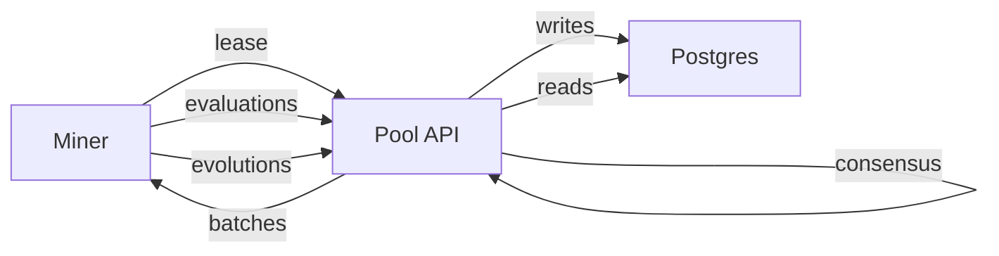

# Pool

The Pool is a separate service that coordinates collaborative mining:

- Miners register and authenticate with Bittensor signatures
- Miners request batches to evolve or evaluate algorithms
- The Pool aggregates evaluations and computes consensus
- Epoch logic turns miner contributions into payouts

## Local dev quickstart with docker compose

The fastest local loop is the sim compose stack:

```bash
docker compose -f Pool/docker-compose.sim.yaml up -d db api monitor
curl -sS http://127.0.0.1:8434/health
```

Open the monitor dashboard:

- `http://127.0.0.1:9000`

## Local dev quickstart without docker compose

If you prefer to run Postgres separately, see the full guide:

- [Pool Functional Testing](../guides/pool-functional-testing.md)

## How work flows



## Tasks, leases, and consensus

The Pool supports two request styles:

- `POST /api/v1/tasks/request` returns a batch id and algorithms
- `POST /api/v1/tasks/lease` returns a lease id plus:
  - algorithms to evaluate
  - seed algorithms to evolve
  - an evolve budget
  - a small gossip packet for miner coordination

Consensus and rewards are computed server-side:

- Evaluation consensus is strict `k-of-n` agreement (configurable `consensus_threshold`) inside tolerance (`tolerance_ratio`), not median-by-default.
- If no agreement cluster reaches threshold, that candidate has no consensus score for that window.
- Positive rewards are gated by:
  - `in_consensus == true`
  - minimum current-window activity (`evaluations_considered + evolutions_considered >= min_reward_activity`)
- Evolver scoring modes are supported in consensus:
  - `sota` (global pre-window baseline)
  - `genealogy` (parent baseline)
  - `local_evolver` (best scored local lease population + parent)
- Optional repetition penalties can be applied by hash (`miner`, `global`, or `both` scope).

## Contracts used by the Pool

Pool reward flow can run in two layers:

1. Off-chain deterministic rewards:
- `scripts/consensus_node.py` computes deterministic per-epoch payouts and Merkle root.
- `scripts/merkle_claim_server.py` serves claim proofs and simulates claims locally.

2. Optional on-chain ink Merkle distributor:
- `scripts/consensus_daemon.py --mode publish` calls contract `publish_epoch`.
- `scripts/consensus_daemon.py --mode verify` can call `challenge_epoch` on mismatches.

For on-chain mode, configure:
- `ONCHAIN_WS_URL`
- `ONCHAIN_CONTRACT`
- `ONCHAIN_METADATA`
- `ONCHAIN_PUBLISHER_SURI`
- `ONCHAIN_VERIFIER_1_SURI`
- `ONCHAIN_VERIFIER_2_SURI`

The contract enforces veto/challenge window and threshold.

## Functional testing and simulators

See [Pool Functional Testing](../guides/pool-functional-testing.md).

## API reference

See [Pool API](../reference/pool-api.md).
