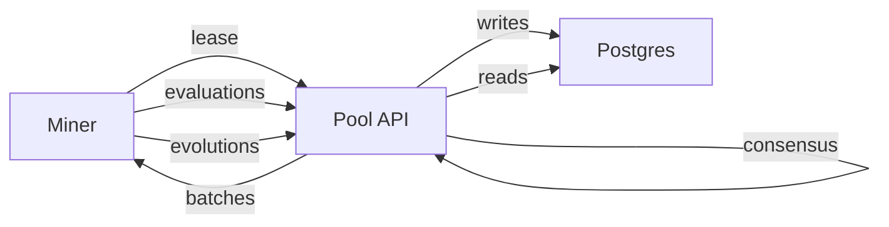

# Pool

Pool 是一个独立服务，用于协调协作挖矿：

- 矿工使用 Bittensor 签名进行注册与认证
- 矿工请求批次任务，用于演化或评估算法
- Pool 聚合评估结果并计算共识
- Epoch 逻辑把矿工贡献转换为支付

## 使用 docker compose 的本地开发快速启动

最快的本地闭环是 sim compose 栈：

```bash
docker compose -f Pool/docker-compose.sim.yaml up -d db api monitor
curl -sS http://127.0.0.1:8434/health
```

打开监控面板：

- `http://127.0.0.1:9000`

## 不使用 docker compose 的本地开发快速启动

如果你更倾向于单独启动 Postgres，请参考完整指南：

- [矿池功能测试](../guides/pool-functional-testing.md)

## 工作流概览



## 任务、租约与共识

Pool 支持两种请求方式：

- `POST /api/v1/tasks/request` 返回 batch id 与 algorithms
- `POST /api/v1/tasks/lease` 返回 lease id，并包含：
  - 待评估的 algorithms
  - 待演化的 seed algorithms
  - 演化预算
  - 用于矿工协作的小 gossip 包

共识与奖励在服务端计算：

- 评估共识使用严格 `k-of-n` 一致性（可配置 `consensus_threshold`）+ 容差 (`tolerance_ratio`)，不是默认中位数模式。
- 若没有任何一致性簇达到阈值，该候选在该窗口不会得到共识分数。
- 正向奖励需要同时满足：
  - `in_consensus == true`
  - 当前窗口活动量达到最小值（`evaluations_considered + evolutions_considered >= min_reward_activity`）
- 共识支持多种演化基线模式：
  - `sota`（全局窗口前基线）
  - `genealogy`（父代基线）
  - `local_evolver`（本地 lease 群体最佳分数 + 父代）
- 可选按哈希重复惩罚（范围：`miner`、`global`、`both`）。

## Pool 使用到的合约

Pool 的奖励流程可以分两层：

1. 链下确定性奖励计算：
- `scripts/consensus_node.py` 计算每个 epoch 的确定性 payout 与 Merkle root。
- `scripts/merkle_claim_server.py` 在本地提供 proof 并模拟 claim。

2. 可选链上 ink Merkle 分发合约：
- `scripts/consensus_daemon.py --mode publish` 调用合约 `publish_epoch`。
- `scripts/consensus_daemon.py --mode verify` 在不一致时可调用 `challenge_epoch`。

启用链上模式需配置：
- `ONCHAIN_WS_URL`
- `ONCHAIN_CONTRACT`
- `ONCHAIN_METADATA`
- `ONCHAIN_PUBLISHER_SURI`
- `ONCHAIN_VERIFIER_1_SURI`
- `ONCHAIN_VERIFIER_2_SURI`

veto/challenge 窗口与阈值由合约侧强制执行。

## 功能测试与模拟器

参考 [矿池功能测试](../guides/pool-functional-testing.md)。

## API 参考

参考 [Pool API](../reference/pool-api.md)。
