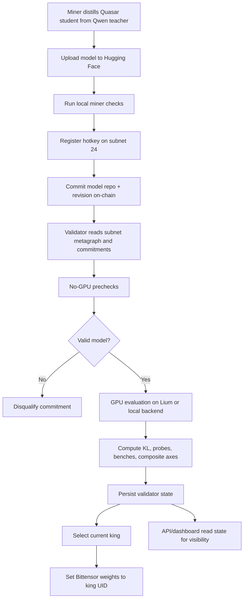

# Quasar System Report

## Executive Summary

Quasar is Bittensor subnet 24. It is built to push small language models toward long-context capability while keeping miner submissions verifiable, public, and comparable on-chain.

The system has four main actors:

- **Miners** distill Quasar student models from the Qwen teacher, upload them to Hugging Face, and commit the model repository on-chain.
- **Validators** read those commitments from subnet 24, verify that each model follows the rules, evaluate valid models on GPU, and set subnet weights toward the current king.
- **The teacher** is the reference model used during evaluation. Current config uses `Qwen/Qwen3.5-4B`.
- **The Quasar student baseline/reference** is `silx-ai/Quasar-3B-A1B-Preview`.

The validator does not simply choose the model with the lowest KL. It computes a composite score across distillation, capability, generation quality, and anti-gaming axes. The current king is the model with the strongest composite result under the validator’s selection rules.

## High-Level Flow



## Miner Lifecycle

Miners submit distilled Quasar student models through the one-shot miner script.

1. The miner distills a Quasar-format student from the Qwen teacher.
2. The model is uploaded to Hugging Face as a public repository.
3. The miner runs pre-submission checks locally.
4. The miner registers a Bittensor hotkey on subnet 24.
5. The miner commits the model repository and revision on-chain.
6. The validator evaluates the committed model.

Commitments are permanent for that hotkey. If a commitment is disqualified, the miner can register a new hotkey and submit a different model.

## Miner Model Requirements

The current Quasar student target is `silx-ai/Quasar-3B-A1B-Preview`; miners improve this Quasar-format student by distilling from the Qwen teacher.

Validator checks enforce the current Quasar model family rather than arbitrary Qwen-style models. Important requirements include:

- Public Hugging Face model repository.
- Safetensors weights.
- Maximum student size from current runtime policy: `3.5B` parameters.
- Vocab size: `248,320`.
- Quasar custom model code must match the allowed files:
  - `configuration_quasar.py`
  - `modeling_quasar.py`
- Quasar config must match the expected architecture fields, including memory, MoE, GLA, and tokenizer settings.
- Tokenizer and chat template must match the official Quasar reference.
- No quantized submissions such as GPTQ, AWQ, GGUF, or FP8.
- Weights must remain public and unchanged after commitment.
- Duplicate or re-sharded copies are disqualified.

Current key Quasar student config:

- Total params target: about `3B`.
- Active params target: about `1B`.
- `d_model`: `1536`.
- Layers: `24`.
- Heads: `12`.
- Head dim: `128`.
- Routed experts: `64`.
- `top_k`: `4`.
- Shared expert size: `3072`.
- Routed expert size: `256`.
- Memory slots: `128`.
- Memory dim: `128`.
- Max sequence length: `16384`.

## Validator Architecture

The validator is split into two trust zones.

**Validator host**

- Holds wallet keys.
- Connects to Bittensor/Subtensor.
- Reads metagraph and commitments.
- Runs no-GPU prechecks.
- Plans evaluation rounds.
- Persists validator state.
- Sets weights on-chain.

**GPU evaluation backend**

- Runs teacher and student inference.
- Computes prompt-level evaluation artifacts.
- Returns results to the validator host.
- Does not need wallet keys.
- Cannot set Bittensor weights.

The GPU backend can be:

- **Lium**, for production-style remote GPU evaluation.
- **Local**, for validators who own GPUs and want to run evaluation on their own machine.

## Validator Runtime

Main entry points:

- `scripts/run_validator.sh`
- `scripts/remote_validator.py`
- `scripts/validator/service.py`

Important production environment variables:

```bash
QUASAR_NETWORK=finney
QUASAR_NETUID=24
QUASAR_WALLET_NAME=validator
QUASAR_HOTKEY_NAME=validator
QUASAR_WALLET_PATH=/path/to/wallets
QUASAR_STATE_DIR=/path/to/state
QUASAR_EVAL_BACKEND=lium
QUASAR_LIUM_POD_NAME=quasar-eval
LIUM_API_KEY=...
SINGLE_EVAL_MODE=1
USE_VLLM=1
```

Production dependency pins currently include:

- `bittensor==9.12.0`
- `async-substrate-interface==1.6.4`
- `lium.io==0.0.8`
- `accelerate==1.13.0`
- `flash-linear-attention` from `SILX-LABS/quasar-flash-linear-attention`

## Validator Epoch Flow

Every validator epoch:

1. Load local validator state.
2. Connect to the configured Bittensor network.
3. Fetch subnet metagraph and current block.
4. Fetch all revealed model commitments.
5. Parse commitments by UID and hotkey.
6. Repair stale local state when safe.
7. Run prechecks on committed models.
8. Select models that need evaluation.
9. If no new challenger exists, keep the current king and sync weights if needed.
10. If challengers exist, sample block-seeded prompts.
11. Run GPU evaluation.
12. Persist results, composite scores, history, and disqualification records.
13. Select king.
14. Set winner-take-all weights to the king UID.

## Prechecks

Prechecks are designed to avoid wasting GPU time and to block invalid submissions before evaluation.

They verify:

- Model repository exists and is public.
- Config exists and matches Quasar requirements.
- Tokenizer matches the reference tokenizer.
- Chat template hash matches the official template.
- Safetensors weights are present.
- Parameter count is within the limit.
- Quantized weights are rejected.
- Hugging Face revision is pinned and unchanged.
- Exact weight duplicates are rejected by hash.
- Re-sharded duplicates are rejected by tensor-content hash.
- Known disqualified commitments are skipped.
- Recycled UID or changed hotkey state is handled safely.

Disqualification is per commitment, keyed by hotkey and commit block.

## Evaluation

GPU evaluation lives in:

- `scripts/pod_eval_vllm.py`
- `eval/kl_divergence.py`
- `scripts/validator/results.py`
- `scripts/validator/composite.py`
- `scripts/validator/single_eval.py`

The teacher is currently:

```text
Qwen/Qwen3.5-4B
```

The validator uses vLLM for teacher generation where available. Teacher outputs are converted into top-k probability targets. The student is then scored against those targets and through additional probes.

Current runtime config:

- `maxNewTokens`: `8192`
- `maxPromptTokens`: `1024`
- `evalPromptsFull`: `60`
- `evalPromptsH2h`: `300`
- `vllmConcurrency`: `32`
- `maxKlThreshold`: `2.0`

Prompt sampling is block-seeded so miners cannot know the exact evaluation prompts before the relevant block is available.

## Composite Scoring

Composite scoring is the production ranking layer. KL is one signal, not the whole decision.

The composite converts multiple evaluation axes into normalized scores in `[0, 1]`, then stores:

- `worst`: the weakest active axis.
- `weighted`: weighted average across active axes.
- `axes`: per-axis details.
- `n_axes`: number of populated axes.

The reason for using composite scoring is simple: a model can match token distributions while still failing at useful behavior. Composite scoring prevents a model from winning purely by shallow imitation.

The validator uses composite state from:

```text
state/composite_scores.json
```

In single-eval mode, king selection is based on stored composite records and dethronement rules. The default single-eval dethrone margin is `3%`.

## Weight Setting

The validator uses winner-take-all weights:

- King UID: `1.0`
- Every other UID: `0.0`

The weight vector is submitted on-chain by the validator wallet. The GPU backend never signs or submits weights.

Successful evaluation without successful weight setting means the scoring pipeline worked, but the validator has not completed the chain action for that epoch.

## Anti-Gaming

Quasar includes several anti-gaming protections:

- Permanent model hash tracking.
- Tensor-content hash tracking for re-sharded copies.
- Activation/fingerprint similarity checks.
- Earlier commitment wins duplicate ownership.
- Revision-pinned model integrity.
- Public repository requirement.
- Quantization rejection.
- Tokenizer and chat-template enforcement.
- Block-seeded prompt selection.
- Procedural/probe-based evaluation axes.
- Per-commit disqualification records.

These protections are designed to make copying, changing weights after commitment, or exploiting evaluation format materially harder.

## State Files

Validator state is stored in the configured `QUASAR_STATE_DIR`.

Important files include:

- `scores.json`: legacy/telemetry KL score table.
- `composite_scores.json`: canonical composite records.
- `disqualified.json`: disqualification reasons.
- `evaluated_uids.json`: commitments already evaluated.
- `model_hashes.json`: revision and weight hash tracking.
- `h2h_history.json`: evaluation history.
- `h2h_latest.json`: latest evaluation summary.
- `eval_progress.json`: live progress for dashboard/API.
- `current_round.json`: crash/resume metadata.
- `uid_hotkey_map.json`: UID to hotkey mapping.
- `validator_log.json`: structured validator events.

## API and Dashboard

The API and dashboard are read-only visibility layers. They do not decide winners and they do not set weights.

They expose:

- Current king.
- Queue/current evaluation progress.
- Miner commitments.
- Scores and composite records.
- Disqualification reasons.
- Metagraph data.
- Market/subnet display data.

The frontend reads public API/dashboard data. Backend deployment details are operational infrastructure, not part of the scoring mechanism.

## Current Local Full-Cycle Test Status

The latest local full-cycle test used:

- Local Subtensor chain in Docker.
- Local subnet `netuid 2`.
- Real Bittensor wallets.
- Real miner commits through `miner/miner.py`.
- Real validator process through `scripts/run_validator.sh`.
- Lium GPU backend.
- Real Hugging Face model: `silx-ai/Quasar-3B-A1B-Preview`.

Observed result:

- Miner 1 committed `silx-ai/Quasar-3B-A1B-Preview`.
- Miner 2 committed the same model later.
- Validator accepted UID 1.
- Validator disqualified UID 2 as a later duplicate.
- Validator ran GPU evaluation successfully.
- Composite state was written.
- UID 1 became the selected king.

The remaining issue is chain weight submission on the local chain:

```text
Subtensor returned SubstrateRequestException(Invalid Transaction): Transaction has a bad signature
```

This happened after evaluation completed. That means the model validation, Lium execution, duplicate detection, scoring, composite merge, and king selection all ran. The failure is specifically in the final `set_weights` extrinsic signing/submission path on localnet.

Most likely areas to inspect:

- Validator wallet/hotkey identity on the local chain.
- Whether the registered validator hotkey matches the wallet used by `set_weights`.
- Localnet validator registration/permission state.
- SDK/runtime signing compatibility for Bittensor `9.12.0` and `async-substrate-interface==1.6.4`.
- Whether local chain state changed after wallet creation or registration.

This should be treated as a real technical issue until the exact cause is confirmed.

## Production Readiness Notes

What is already working:

- Miner prechecks.
- On-chain commitment submission.
- Commitment parsing.
- Quasar architecture checks.
- Duplicate disqualification.
- Lium-backed GPU evaluation.
- Composite score generation.
- King selection.
- State persistence.
- API/dashboard state model.

What needs final verification:

- Successful `set_weights` on the target production chain.
- Validator wallet/hotkey registration and permissions on subnet 24.
- Clean production env file loading.
- Long-running validator restart/resume behavior under production process manager.

## Operational Rule of Thumb

If evaluation fails, investigate model loading, GPU backend, vLLM, prompts, or pod logs.

If evaluation succeeds but weights fail, investigate wallet identity, chain registration, SDK signing stack, and `set_weights` extrinsic submission.

The latest failure is in the second category.
