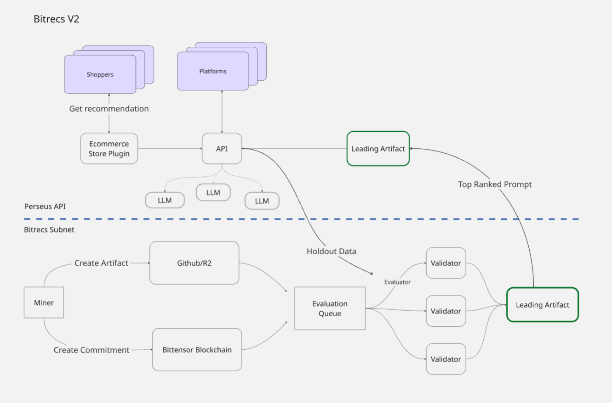

<div align="center">

# Bitrecs V2


[](https://discord.gg/bittensor)
[](https://opensource.org/licenses/MIT) 

[X](https://x.com/bitrecs) • [Discord](https://discord.gg/bittensor) • [Website](https://bitrecs.ai/) • [Dashboard](https://dashboard.bitrecs.ai/)
</div>


**What is Bitrecs V2?** 

Bitrecs V2 is a prompt evolution subnet which rewards miners who optimize an artifact.yaml, an object containing a prompt, model, temperature and other parameters against a rotating set of challenging ecommerce evaluations. Miners submit artifacts via the CLI by making an onchain commitment to begin evaluation.

**What does Bitrecs do?**

Bitrecs is a novel recommendation engine powered by Bittensor. Our flagship product is an ecommerce recommendation widget which drives sales for merchants by utilizing the newest state of the art models and novel generative recommendation techniques. Merchants can expect to see personalized customer journey experiences drive higher average order values, resulting in more sales. 

**Scoring**

Bitrecs V2 employs a winnter take all (WTA) scoring engine to evaluate miner submissions against a diverse set of ecommerce tasks. Submissions are scored based on performance across multiple environments, using ε-Pareto dominance to identify non-dominated miners on the frontier rewarding genuine improvements. Scores incorporate statistical robustness via epsilon tolerances, account for sample sizes, and apply linear decay factors over time (with a 3-day grace period and 5% daily reduction to a 25% floor). The engine then computes winner-takes-all weights, prioritizing miners who surpass thresholds set by earlier participants, and sets these weights onchain for the top-performing miner to receive emissions.

## Validator

See [Validator Setup](docs/validator_setup.md)

## Miner

See [Miner Setup](docs/miner_setup.md)

## API

Create .env [Environment Example](api/.env.example)

```
uv sync
uv run uvicorn api.main:app --access-log --log-level debug
```

## V2 Flowchart

<sup>Bitrecs V2 separates inference from prompt evolution</sup>


