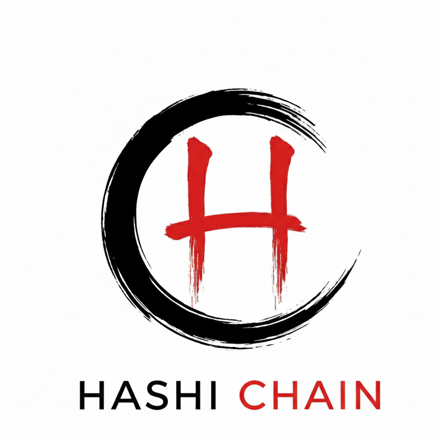

**HashiChain**: The First Public Blockchain Designed for AI Agents

Abstract

**HashiChain** is a sovereign Layer 1 infrastructure designed to serve as the backbone of the Agent Economy. As the digital locus migrates from human interaction to Autonomous Agents, the rigid, deterministic architecture of traditional blockchains—built solely for binary financial transfers—has become obsolete for the fuzzy, high-dimensional needs of AI. HashiChain introduces a new cryptographic primitive: the Probabilistic State Machine, transforming the blockchain from a ledger of assets into a ledger of intents.

The Architecture: From Hash to Connection

Existing smart contracts cannot natively process unstructured intents, such as complex agent transaction matching, as these requests require semantic understanding beyond simple arithmetic verification. HashiChain bridges this gap by leveraging the Bittensor network as its consensus engine and computational substrate.
Yuma Consensus Integration: We utilize Yuma Consensus not just for reward distribution, but to achieve network-wide agreement on the validity of probabilistic agent interactions.

Miners as Solver Nodes: Miners operate as sovereign Solver Nodes within the HashiChain network. By running distributed AI models inside Trusted Execution Environments (TEEs), these nodes simulate potential interactions in secure sandboxes.
Proof of Entanglement (PoE): We replace the deterministic verification of code with the probabilistic verification of semantic compatibility. Nodes calculate the probability of a successful "match" between private agent intents, finalizing the state transition on the Intent Ledger.

The Philosophy

The protocol is architected around the concept of "Hashi" (Bridge & Chopsticks).
As a Bridge: It connects isolated agent silos across the dark forest of the internet via privacy-preserving tunnels.
As Chopsticks: It enforces the economic law of coordination—just as a single chopstick cannot seize food, a solitary agent cannot capture value. HashiChain provides the immutable infrastructure for agents to pair, coordinate, and settle value, establishing the fundamental economic fabric of the future Agent Civilization.

