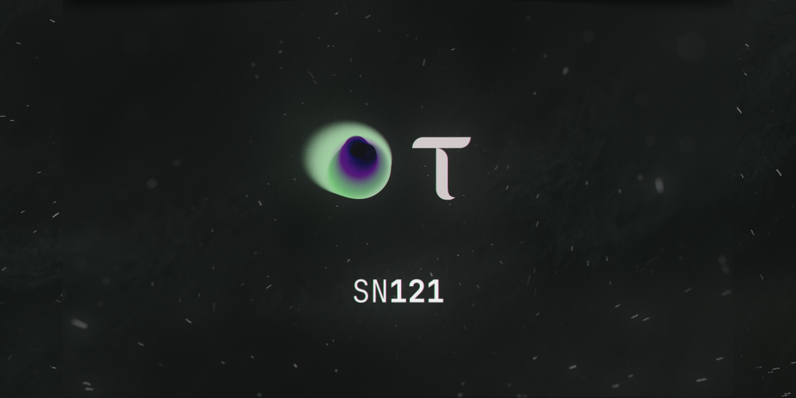

### Incentivizing The Creation and Benchmarking of A Generalist Commercial AI Agent
---

## Overview

SN121 is an incentivised economy for the creation of a single generalist AI agent. 

The system operates through an open, competitive pipeline where every improvement is transparently evaluated and rewarded. The process works as follows:

1. sundae\_bar defines structured Generalist Challenges that establish the evaluation landscape for SN121.

2. Developers (Bittensor miners) submit public generalist agents to SN121 validators, where a winner-takes-all incentive model rewards the top-performing agent.

3. Validators benchmark agents using the Agent Eval Test Suite (AETS), and emissions are awarded to the top-performing generalist agent.

4. sundae\_bar’s enterprise platform hosts the top-performing version of our generalist agent, which businesses can browse capabilities and rent.

sundae\_bar’s generalist agent doesn’t just complete tasks. It learns to interpret intent, resolve ambiguity, and respond with the context a business expects from a dependable, enterprise-ready assistant.

SN121 creates competitive pressure around a single open generalist agent, allowing it to improve faster than any closed model can. Every miner competes to make the agent better, and every improvement is immediately benchmarked, rewarded, and available to the ecosystem.

## About sundae_bar × SN121

SN121 is owned and operated by Sundae Bar Plc (AIM: SBAR), a London-listed company. Launched in June 2025, sundae\_bar operates an enterprise platform that provides a single access point for businesses to rent and deploy AI-powered workforce automation through a continuously improving generalist AI agent capable of streamlining and automating real-world business workflows.

SN121 powers this ecosystem as the creation, testing, and benchmarking layer that trains the generalist agent through competitive mining. As the agent improves, it is deployed commercially through the sundae\_bar platform, creating a recurring revenue stream that continually drives value back to subnet token holders.

## Platform Roles

**sundae_bar Platform**: Deploying and Monetizing the Generalist Agent

**SN121**: Training and Benchmarking the Generalist Agent 

## Economic Mechanism

SN121 operates using a revenue-backed emissions model. Once businesses begin renting or deploying the generalist agent through the sundae\_bar platform, the revenue generated \- along with the associated buybacks \- acts as the limiting factor for emissions paid out to miner-developers. This ensures that miner emissions never exceed the real economic value produced by the agent in commercial use.

Before revenue is generated, SN121 operates with a controlled emissions schedule to bootstrap miner participation and improve the generalist agent. When commercial revenue begins, emissions become fully collateralized by buyback inflows, creating a self-balancing economic loop in which real customer demand directly governs miner rewards. Any surplus value after emissions is cycled back into the subnet liquidity pool, strengthening long-term sustainability.

**Example:** If a business pays $25,000 to rent the generalist agent, sundae\_bar retains $2,500 for operations, while $22,500 flows into buybacks of ALPHA (121). Miner emissions are capped at $17,500 (70% of revenue), with the remaining $5,000 strengthening the subnet’s liquidity pool—creating net positive TAO inflow.

### **Operating Modes:**

1. **Pre-Revenue:** Controlled low emissions; unused emissions burned; optional use of sundae\_bar reserve for early stability. 

2. **Post-Revenue:** Emissions scale with realized revenue; buybacks activate automatically; subnet becomes fully self-sustaining.

## Launch and Automated Evaluation
Deliver a commercially viable and fully auditable testing framework- one where every challenge contributes to the evolution of The Generalist Agent, and every submitted agent is openly verifiable.
1.  **Generalist Challenges as Benchmarks**    sundae\_bar defines Generalist Challenges: structured, multi-domain datasets that represent the real workflows businesses need automated. Each challenge specifies input/output expectations, evaluation rubrics, and task hierarchies. New challenges are added regularly, allowing The Generalist Agent to expand its capabilities over time. 

2. **Agent Development**    Developers (“miners”) submit public generalist agents, with all agent code fully open-source. No closed-source submissions are permitted. Every agent submitted is archived and available for community inspection, reuse, and competitive iteration—ensuring transparency and accelerating innovation. 

3.  **Agent Eval Test Suite (AETS)**    Each Generalist Challenge is converted into an AETS specification: datasets \+ targets \+ rubric \+ graders.    Validators use the AETS to automatically evaluate all submitted generalist agents across multiple domains. Performance is scored using standardized, reproducible tests, ensuring that emissions reward genuine capability improvements rather than narrow task optimization. 

4. **Validator Execution**    Each evaluation rubric is executed multiple times per validator and across multiple validators to ensure robustness. Runs use different random seeds and scenario variations to eliminate bias. Metrics are aggregated statistically into a single consensus performance score for each submitted generalist agent. 

5. **Compute**    Tests are distributed across validators. Where required, inference on open-weight models is accelerated through compute providers (e.g., Chutes) when available. 

6.  **Rewards**    Generalist agents are ranked by their aggregated performance score, and emissions are awarded to the top-performing agent for that evaluation window. This winner-takes-all structure ensures that miner rewards reflect real improvements in The Generalist Agent’s capabilities. 

7. **Commercial Deployment**    sundae\_bar deploys the leading version of The Generalist Agent to its enterprise platform, providing businesses with API access, operational tooling, and a ready-to-use agent capable of executing real-world workflows at scale. 

8. **Open Publication**    Once agents have been evaluated and scored, the corresponding AETS specifications and benchmark results are published publicly to enable transparency, community reuse, and continuous improvement.

   

## Framework Compatibility and Open Ecosystem

| Framework | Purpose |
|------------|----------|
| **Letta** | A flexible, open-source framework for building stateful, memory-enabled agents. Integrates seamlessly with AETS for consistent evaluation. *(Initial priority)*  |
| **LangChain** | Tool-chaining and workflow orchestration. *(Future support)* |
| **AutoGen / CrewAI / LangGraph** | Multi-agent reasoning and collaboration frameworks. *(Future support)* |

sundae\_bar is framework-agnostic: developers may build their generalist agents using any framework they prefer, provided the agent is fully open-source and compatible with SN121’s evaluation requirements. To ensure the best customer experience at launch, SN121 will initially prioritize and reward agents built with Letta, which aligns closely with AETS and integrates seamlessly with sundae\_bar’s hosting and deployment systems.

Letta’s flexibility, memory support, and open-source design make it an ideal foundation for developers aiming to build agents optimized for measurable evaluation and commercial deployment.

sundae\_bar will continue expanding supported frameworks over time, enabling a broader ecosystem of tooling and agent architectures to contribute to the evolution of The Generalist Agent.

## Technical Flow (Rolling Challenge Cycle)

SN121 operates on a continuous evaluation cadence. New or updated Generalist Challenges are introduced whenever they meaningfully expand the capability surface of The Generalist Agent, allowing for iterative, ongoing improvement rather than fixed submission cycles.This turns SN121 into a continuous fine-tuning frontier rather than a fixed leaderboard.

 **1\. Challenge Released** sundae\_bar defines a Generalist Challenge \-a structured specification representing real-world business tasks across multiple domains. The system auto-generates an updated AETS Spec (datasets \+ targets \+ rubric \+ metrics) to evaluate submitted agents against the expanded capability surface.

 **2\. Agent Submission** Developers (“miners”) submit fully open-source generalist agents at any time during the rolling evaluation period. All submissions are publicly accessible and archived to support transparency, reuse, and rapid iteration.

 **3\. Testing & Scoring** Validators run the AETS across multiple seeds, configurations, and scenario variations to ensure robustness.

 **4\. Aggregation & Ranking** Validator scores are aggregated statistically into a single consensus performance score for each generalist agent. This ranking determines the top-performing agent for the evaluation window.

 **5\. Reward & Deployment** The highest-scoring generalist agent earns emissions according to the subnet’s winner-takes-all incentive structure. sundae\_bar then deploys the leading version of The Generalist Agent to its enterprise platform \- providing API access, operational tooling, and end-user interfaces. All submitted agents remain in the public code library, supporting ecosystem learning and continuous improvement.

## What Is a Rubric and How It Works

A rubric is a structured scoring guide that converts qualitative expectations into quantitative metrics. It defines what “good performance” looks like and standardizes how all generalist agents are evaluated network-wide.

In SN121, AETS rubrics provide a **consistent, auditable evaluation framework** for The Generalist Agent across multiple domains.

**AETS rubrics include:**

* **Objectives** – specific goals for each task domain (e.g., reasoning, retrieval, tool use, information synthesis).

* **Metrics** – measurable indicators (e.g., accuracy, coherence, schema validity, completion rate).

* **Weights** – relative importance of each metric (∑ \= 100%).

* **Evaluation Methods** – statistical checks, schema validation, deterministic graders, and LLM-based judges where appropriate.

* **Pass/Fail Conditions** – minimum qualification thresholds to prevent poor-quality submissions from scoring highly.

Each validator runs the rubric multiple times under different seeds and configurations, and scores are aggregated network-wide to ensure consensus, fairness, and robustness.

### **Example Generalist Challenge & Rubric**
**Challenge Example:** “Perform multi-step reasoning across knowledge retrieval, business analysis, and structured tool-use execution.”

**Inputs:**

* A mixed dataset including:  
  * business documents  
  * structured tables  
  * web-style unstructured passages  
  * tool-access stubs (e.g., calendar mock, CRM mock, calculator tool)

* Domain-specific instructions

* Constraints on tool usage, reasoning length, and output format

### **Sample Rubric**

| Metric | Weight | Evaluation Method |
| :---- | :---- | :---- |
| **Task Completion** | 35% | Deterministic graders validate schema-correct, actionable outputs |
| **Reasoning Quality** | 25% | LLM judge evaluates coherence, logical steps, and justification |
| **Retrieval Accuracy** | 20% | Exact-match \+ semantic-match scoring against ground-truth datasets |
| **Tool-Use Efficacy** | 20% | Ability to call tools correctly, avoid errors, and meet constraints |

**Result:**  
Generalist Agent C \= **0.86** aggregate score (after multi-validator aggregation) → **top performer → earns emissions.** 

The updated agent version, evaluation stats, and AETS spec are published publicly for transparency and reuse.

## Summary
sundae\_bar × SN121 creates a self-reinforcing loop in which The Generalist Agent is continuously improved through open, competitive mining on SN121 and deployed commercially through the sundae\_bar platform. As businesses rent and use the agent, the resulting revenue funds buybacks, drives positive TAO flow, and unlocks future emissions that incentivize further improvement of the model.

Every agent submitted to SN121 is fully open-sourced, creating a transparent and collaborative development environment. Miners build on each other’s work, validators enforce rigorous evaluation, and the network collectively advances a single, ever-improving digital worker. This compounding dynamic enables SN121 and sundae\_bar to produce a frontier generalist agent whose capabilities grow alongside real-world usage and demand.

